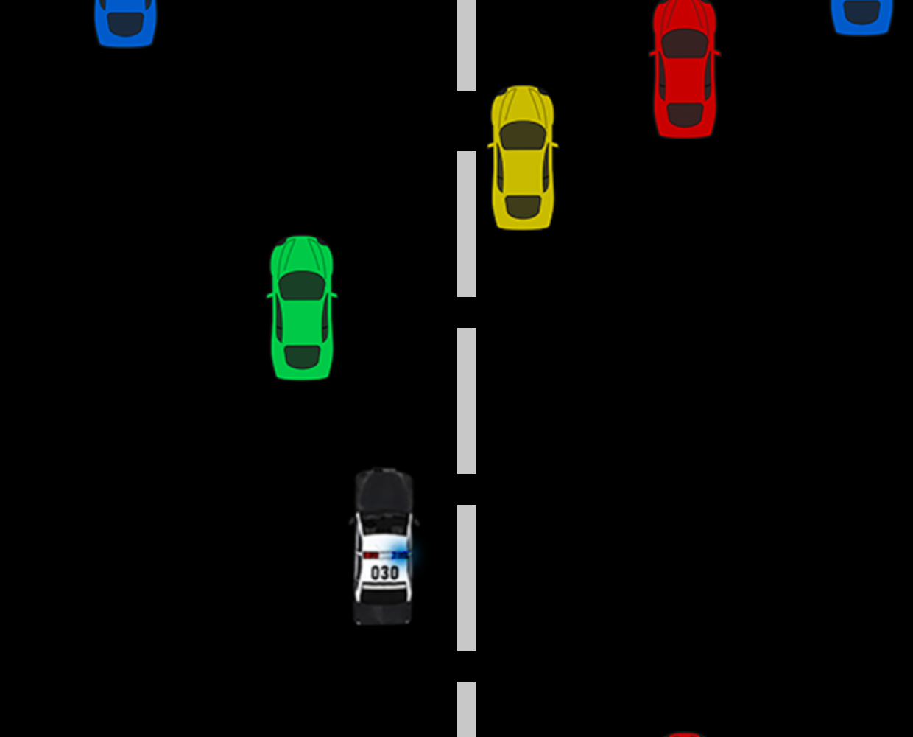

# 🚓 Police Car Barcode Game

A simple and fun 2D game built with p5.js where you control a police car moving between lanes to dodge incoming traffic. You can control the car using keyboard arrows or barcode scanner input. If you crash into another car — it's game over!

 <!-- Add a screenshot of the game here -->

---

## 🎮 How to Play

- **Move Left** → Press `→` key or scan barcode `left`
- **Move Right** → Press `←` key or scan barcode `right`
- **Goal**: Avoid hitting any incoming cars.
- The game ends if the police car collides with any vehicle.

---

## 🛠️ Features

- 5-lane highway simulation
- Random traffic with different vehicle types
- Police car controlled via keyboard or barcode
- Collision detection system
- "Game Over" screen on crash

---

## 📂 Project Structure
```bash
.
│   index.html
│   p5.dom.min.js
│   p5.js
│   README.md
│   sketch.js
│
└───cars
        blue.png
        green.png
        police.png
        police1.png
        police2.png
        red.png
        yellow.png
```
